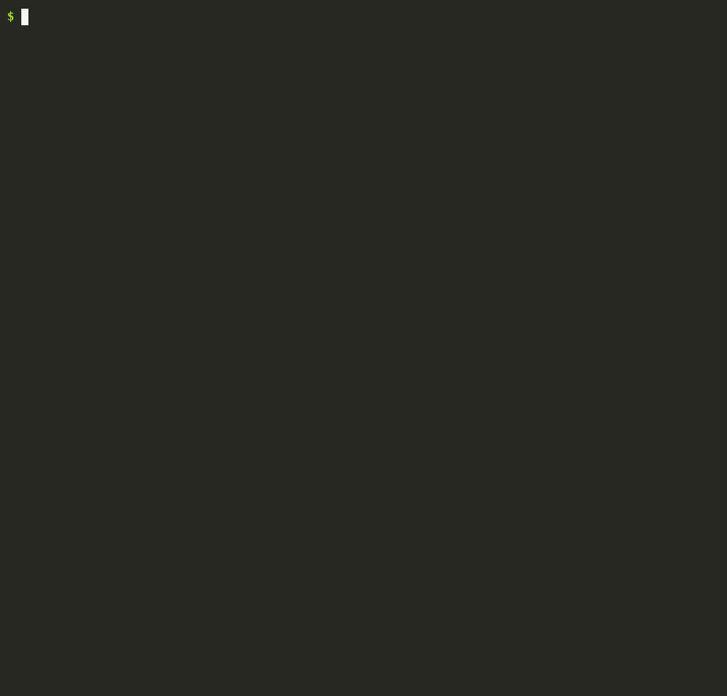

# 🛡️ AgentShield

**Catch the mistakes AI coding tools make before they merge.**

AI assistants write code fast, and sometimes they write it wrong in
predictable ways: they import packages that don't exist (attackers register
those names and fill them with malware, which is called "slopsquatting"),
paste a real API key in to "make it work", or delete the failing test
instead of fixing the bug. AgentShield reads a code change and points at
those lines, with a 0–100 risk score and a concrete fix for each.



## What it catches

| Check | Example | Severity |
|---|---|---|
| Package doesn't exist | `flask-auth-helper` in requirements.txt | HIGH |
| Removed by npm for malware | `0.0.1-security` stub | HIGH |
| Look-alike of a popular package | `reqeusts`, `lodahs` | MEDIUM, HIGH if brand new |
| Brand-new package (< 30 days) | first published 5 days ago | MEDIUM |
| Unknown import | `import langchain_memory_tools` | MEDIUM |
| Leaked key: AWS, GitHub, OpenAI, Anthropic, Stripe, Slack, private keys, DB URLs | `stripe.api_key = "sk_live_..."` | HIGH |
| Random-looking value in a secret-named variable | `api_key = "q8Zr..."` | MEDIUM |
| Destructive migration | `DROP TABLE`, `op.drop_column` (not in `downgrade()`) | HIGH |
| Access check removed | `@login_required` deleted from a view | MEDIUM |
| Tests deleted, skipped or `.only`'d | `@pytest.mark.skip`, `it.only(` | MEDIUM |
| Security setting turned off | `verify=False`, `DEBUG = True`, CORS `"*"` | MEDIUM |
| Dangerous call | `eval`, `shell=True`, `pickle.loads`, `yaml.load` | MEDIUM |
| Auth code touched; source changed with no tests | `app/auth/session.py` | LOW |

Secrets are masked in every report (`sk_l********`). If a registry can't be
reached, AgentShield says "couldn't verify" instead of guessing.

## Install

Python 3.11+, no dependencies.

```bash
git clone https://github.com/Vikhram-123/agentshield && cd agentshield
python3 -m venv .venv && source .venv/bin/activate
pip install -e .
```

## Use

```bash
agentshield scan                     # everything changed since your last commit
agentshield scan --base main         # what this branch adds on top of main
agentshield scan --staged            # only what you've staged
agentshield scan --diff pr.diff      # any diff file (or "-" for stdin)
agentshield scan --format markdown   # for PR comments (also: json)
agentshield scan --offline           # no network: typo checks only
agentshield scan --fail-on medium    # exit code 1 on medium+ (for CI)
```

Try the demo above yourself: `python examples/demo.py`.

Exit codes: `0` passed, `1` findings at or above `--fail-on` (default
`high`), `2` couldn't run (bad config, not a diff, git error).

## GitHub Action

Scan every pull request and post the report as a comment:

```yaml
# .github/workflows/agentshield.yml
name: agentshield
on: pull_request
permissions:
  contents: read
  pull-requests: write
jobs:
  scan:
    runs-on: ubuntu-latest
    steps:
      - uses: actions/checkout@v4
        with:
          fetch-depth: 0
      - uses: Vikhram-123/agentshield@v1
        with:
          fail-on: high              # high | medium | low | never
```

The comment is edited in place on each push (no comment spam), and the
report is always in the job summary too. PRs from forks get a read-only
token, so their report is only in the job summary. AgentShield deliberately
doesn't use `pull_request_target`, which would hand fork code a write token.

## Configure

Optional. Put a `.agentshield.toml` in the repo root:

```toml
fail_on = "medium"                     # high | medium | low | never
fail_score = 60                        # also fail if the risk score reaches 60
ignore_paths = ["vendor/", "*.min.js"]
ignore_rules = ["risky.no-tests"]      # or a whole family: "secret"
allow_packages = ["acme-internal-sdk", "@acme/*"]
new_package_days = 30
```

Or silence one line in place:

```python
result = eval(expr)  # agentshield: ignore[risky.dangerous-call]
```

Hidden findings are always counted in the report's notes, so nothing is
suppressed silently. Unknown settings are an error, not ignored.

## How well does it work?

Measured on real public pull requests. Method, labels and every number are
in [`bench/RESULTS.md`](bench/RESULTS.md).

| | |
|---|---|
| Held-out set | 143 PRs (90 AI-assisted), scanned once with the finished tool |
| Precision | **72%** of findings were right (18/25, 95% CI 52–86%) |
| Recall | 32/32 planted in-scope problems found (an upper bound; 0/6 out-of-scope cases) |
| Speed | median ~10 ms per PR, plus registry lookups (0.4 s at the 95th percentile) |

The tool was tuned on a separate development set (precision 36% → 74%
there) before the held-out set was collected. Labels follow written
criteria and still need an independent human check.

**Known limits:** secrets need a known key format or a secret-sounding
variable name; plain short passwords aren't flagged; package checks cover
Python and JavaScript only; path rules decide what counts as a test.

## How it works

```
 git diff ─▶ diff.py ──▶ checks/packages.py ─▶ registry.py (PyPI / npm, parallel, cached)
            added lines  checks/secrets.py      regex + entropy, masked
            + line #s    checks/risky.py        auth, migrations, tests, settings, calls
                              │
                              ▼
                         config.py (ignores) ─▶ report.py (text / markdown / json + score)
```

Every check takes the parsed diff and returns `(findings, notes)`. The
reasoning behind each design choice is in [`DECISIONS.md`](DECISIONS.md).

Standard library only: nothing extra to install, nothing extra to trust.

## Tests

```bash
python3 -m unittest discover -s tests -t . -v
```

Tests use a fake registry (`tests/fake_registry.py`), so they run offline and
always give the same result. Fake keys are built at runtime, so this repo
never contains a key-shaped string.

## License

MIT
